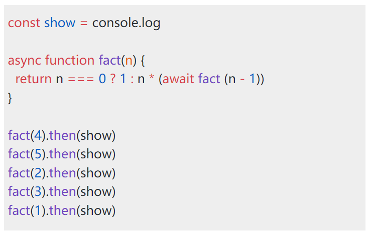

## svg-code-block-vue

This repository is a realization of code block in svg using vue. It was not published to npm. If you have the need of rendering code block in svg, you can refer to this implementation.

## step

Clone this project to your local

```shell
git clone git@github.com:hhk-png/svg-code-block-vue.git
```

and type:

```shell
cd svg-code-block-vue
pnpm installl
pnpm run dev
```

you could see the default display:



